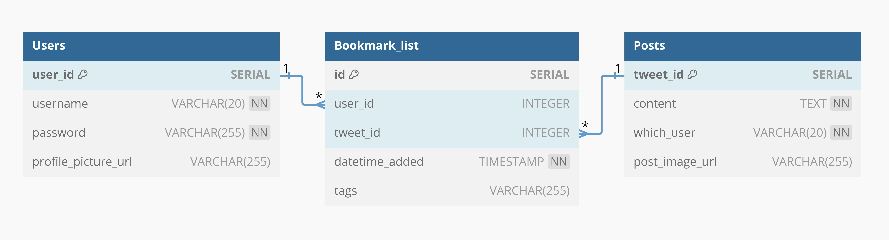

# X Bookmarks Shelve

RESTful implementation for organizing twitter bookmarks. Organize . Built using Hono and Typescript.

|  HTTP   |     Endpoint     |                  Description                  |
| :-----: | :--------------: | :-------------------------------------------: |
| `\GET`  |   `bookmarks`    | Retrieve all bookmarks for the logged-in user |
| `\POST` |   `bookmarks`    |     Add a new bookmark from a Twitter URL     |
| `\POST` | `/auth/register` |              Register a new user              |
| `\POST` |  `/auth/login`   |                 Log in a user                 |
| `\POST` |  `/auth/logout`  |                Log out a user                 |

## Database Structure

This project consist of three table with its schema defined as image below:


## Run Project

To run the project, you can either clone and deploy on your local machine or using Docker. To run on local machine, run

```bash
npm install
npm run dev
```

Then open `http://localhost:3000` on your browser.
